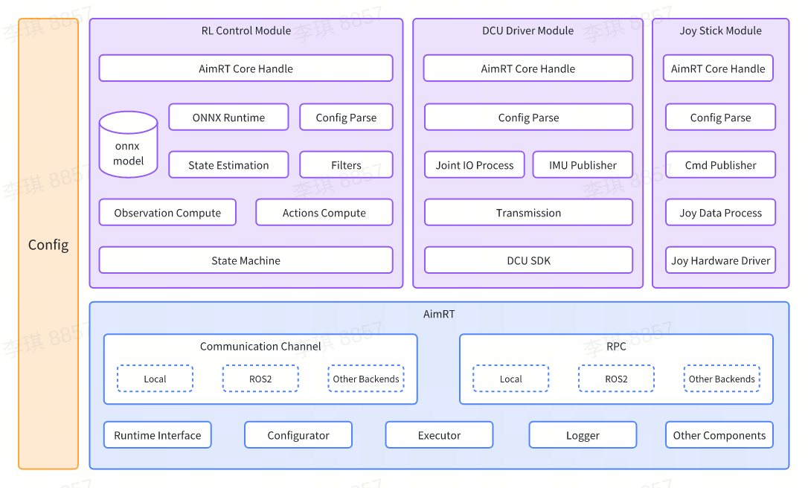

# F1 — Humanoid Robot System (Integration Repo)

[中文](README.zh_CN.md) | English

## What is this repo?

F1 is a **thin integration repository** for the X1 humanoid robot. It does NOT contain subsystem code directly — instead, it wires together two independently developed submodules via Git and provides unified build/run scripts and Docker definitions.

| Submodule | Repository | Build System | Team |
|-----------|-----------|--------------|------|
| `navigation/` | [weilai-robot/Humanoid_navigation](https://github.com/weilai-robot/Humanoid_navigation) | ROS2 colcon | Navigation |
| `motion_control/` | [weilai-robot/Humanoid_motion](https://github.com/weilai-robot/Humanoid_motion) | CMake + AimRT | Control |

The two subsystems communicate at runtime via ROS2 topics — there is zero code-level dependency between them.


## Software Architecture



```
┌─────────── Navigation (ROS2 colcon) ──────────────┐     ┌── Motion Control (CMake + AimRT) ──┐
│                                                     │     │                                      │
│  Livox Driver ──→ FastLIO2 ──→ /Odometry ──────┐   │     │  joy_stick_module                     │
│                                    /cloud_reg..  │   │     │    └── /cmd_vel ──┐                    │
│                       ↓                         │   │     │    └── /walk_mode │                    │
│                 odom_bridge.py                   │   │     │                   ↓                    │
│                       ↓                         │   │     │  control_module                      │
│  Nav2 (AMCL + MPPI + Costmap)                    │   │     │    sub: /cmd_vel_limiter ◄── /cmd_vel │
│    controller_server ──→ /cmd_vel ───────────────┼───┼─────┼──→  (Nav2 or Joystick)                │
│                                                     │     │    → RL Policy (ONNX) → Motor Cmd      │
└─────────────────────────────────────────────────────┘     └──────────────────────────────────────┘
```

> Full architecture doc: [doc/ARCHITECTURE.md](doc/ARCHITECTURE.md)

## Directory Structure

```
F1/                              # This repo — thin integration layer
├── navigation/                  # [submodule] → Humanoid_navigation
├── motion_control/              # [submodule] → Humanoid_motion
├── scripts/                     # Unified build & run scripts
│   ├── build_all.sh            #   Build both subsystems
│   ├── build.sh                #   Build motion_control only
│   ├── build_nav.sh            #   Build navigation only
│   ├── run_mujoco_nav.sh       #   MuJoCo + sim_module joint sim nav (6 tmux panes)
│   ├── run_nav_real.sh         #   Launch real robot navigation
│   ├── send_nav_goal.sh        #   Send navigation goal + trigger walk mode
│   ├── drift_check.py          #   SLAM drift diagnostics
│   ├── axis_check.py           #   Coordinate axis alignment diagnostics
│   ├── nav_test_runner.py      #   Automated navigation test scenarios
│   └── ...
├── cmake/                       # Shared CMake modules (GetAimRT, NamespaceTool)
├── CMakeLists.txt              # Top-level CMake entry (builds motion_control)
├── docker/                     # Docker environment definitions
├── Dockerfile                  # Multi-stage build: motion_control + navigation
├── docker-compose.yml          # Sim navigation container
├── doc/                        # Architecture, submodule guide, API docs
└── README.md
```

---

## Quick Start

### 1. Clone

```bash
git clone --recursive https://github.com/weilai-robot/F1.git
cd F1
```

> Already cloned without `--recursive`? Run:
> ```bash
> git submodule update --init --recursive
> ```

### 2. Prerequisites

- **GCC-13** / **CMake** ≥ 3.24
- **[ROS2 Humble](https://docs.ros.org/en/humble/Installation/Ubuntu-Install-Debians.html)**
- **[ONNX Runtime](https://github.com/microsoft/onnxruntime)** (build from source)

```bash
sudo apt update
sudo apt install -y build-essential cmake git libprotobuf-dev protobuf-complier
```

**Motion control extras:**
```bash
sudo apt install jstest-gtk libglfw3-dev libdart-external-lodepng-dev
```

**Navigation extras:**
```bash
sudo apt install -y \
    ros-humble-nav2-bringup ros-humble-nav2-costmap-2d \
    ros-humble-nav2-controller ros-humble-nav2-planner \
    ros-humble-tf2-tools ros-humble-octomap-server
```

### 3. Build

#### motion_control

```bash
# Release incremental build (default)
./scripts/build.sh

# Clean build from scratch
./scripts/build.sh clean

# Debug build
./scripts/build.sh Debug
```

Build artifacts are placed in `build/install/bin/`:

| Artifact | Description |
|----------|-------------|
| `aimrt_main` | AimRT main binary |
| `libpkg1.so` | Shared library registering all 5 modules |
| `cfg/x1_cfg.yaml` | Real-robot top-level config |
| `cfg/control_module/rl_x1.yaml` | Real-robot control config (freq, joints, ONNX policy) |
| `cfg/control_module/policy/*.onnx` | RL policy models |
| `cfg/dcu_driver_module/dcu_x1.yaml` | DCU hardware driver config (EtherCAT, actuators, transmission) |
| `run.sh` / `run_with_recording.sh` | Real-robot run scripts |

The script automatically verifies all artifacts after compilation.

#### navigation

```bash
./scripts/build_nav.sh
```

#### Build both

```bash
./scripts/build_all.sh
```

---

### 4. Real-Robot Deployment (motion_control only)

> Complete steps to deploy and run motion control on the real robot.

#### 4.1 Pre-flight Checks

| Item | Config File | Current | Notes |
|------|-----------|---------|-------|
| EtherCAT interface | `cfg/dcu_driver_module/dcu_x1.yaml` → `ethercat.ifname` | `enp2s0` | ⚠️ Must match actual NIC name |
| DCU EtherCAT IDs | `dcu_x1.yaml` → `dcu_network[].ecat_id` | body=1, hip=2 | Per physical chain order |
| IMU source | `dcu_x1.yaml` → `imu_dcu_name` | `hip` | Uses lower-limb DCU IMU |
| Control frequency | `cfg/control_module/rl_x1.yaml` → `control_frequecy` | `1000` Hz | MainLoop 1 ms period |
| EtherCAT cycle | `dcu_x1.yaml` → `ethercat.cycle_time_ns` | `1000000` ns (1 ms) | Must match control freq |
| Joint offsets | `rl_x1.yaml` → `joint_offset` | all `0.0` | Adjust per actual zero calibration |

#### 4.2 Launch Control

```bash
cd build/install/bin

# 1. Grant raw socket permission (required for EtherCAT; redo after re-copying binary)
sudo setcap cap_net_raw=ep ./aimrt_main

# 2. Launch (Option A: control only)
./aimrt_main --cfg_file_path=./cfg/x1_cfg.yaml
# or equivalently
bash run.sh

# 2. Launch (Option B: control + ROS2 bag recording)
bash run_with_recording.sh
```

Modules loaded by `x1_cfg.yaml`:

| Module | Responsibility |
|--------|---------------|
| `JoyStickModule` | Joystick / Nav2 → `/cmd_vel` velocity command conversion |
| `ControlModule` | State machine + RL/PD control + data logging |
| `DcuDriverModule` | EtherCAT hardware driver (reads IMU/joint states, sends motor commands) |

> The real-robot config does **not** include `SimModule` (simulation only). The real robot relies on the DCU driver to provide `/imu/data`, `/joint_states`, and to consume `/joint_cmd`.

#### 4.3 State Machine Operation

The robot starts in `initial_state` (set in `rl_x1.yaml`). Trigger state transitions via ROS2 topics:

```bash
# — Standard power-on sequence —
ros2 topic pub --once /idle_mode  std_msgs/msg/Float32 '{data: 0.0}'   # Idle (powered, not enabled)
ros2 topic pub --once /zero_mode  std_msgs/msg/Float32 '{data: 0.0}'   # Zero (enable + return to zero)
ros2 topic pub --once /stand_mode std_msgs/msg/Float32 '{data: 0.0}'   # Stand

# — Walking (from stand) —
ros2 topic pub --once /walk_mode  std_msgs/msg/Float32 '{data: 0.0}'   # walk_leg (legs only)
ros2 topic pub --once /walk_mode2 std_msgs/msg/Float32 '{data: 0.0}'   # walk_leg_arm (legs + shoulders)

# — Velocity command (while walking) —
ros2 topic pub /cmd_vel_limiter geometry_msgs/msg/Twist '{linear: {x: 0.2}, angular: {z: 0.0}}'
```

State transition rules are defined in `rl_x1.yaml` → `robot_states`. Invalid transitions are rejected by the state machine.

#### 4.4 Data Logging

The control module has a built-in data acquisition system that **triggers automatically upon entering `walk_leg` / `walk_leg_arm`** — no extra action needed.

| Log | Format | Path | Rate | Duration |
|-----|--------|------|------|----------|
| `walk_diag_<timestamp>.csv` | CSV text | `test_logs/data_csv/` | 100 Hz | 10 s (1000 frames) |
| `tm_obs_input_<timestamp>.bin` | Raw float binary | `test_logs/data_csv/t_m/` | 100 Hz | 10 s (1000 frames) |

- **walk_diag**: Per-frame timestamp, gait phase, velocity commands, Euler angles, angular velocities, per-joint action/pos/vel/effort/PD targets (raw + filtered), IMU quaternion/gyro/accel.
- **tm_obs_input**: Complete observation vector fed to the ONNX policy network, for offline replay.

Files are auto-closed after 1000 frames or 500 ms idle after leaving walk mode. Log paths are relative to the process CWD (i.e. `build/install/bin/test_logs/`).

---

### 5. Simulation

| Scenario | Command |
|----------|---------|
| Sim walking only | `cd build/install/bin && ./run_sim.sh` |
| Full sim navigation | `./scripts/run_mujoco_nav.sh` then `./scripts/send_nav_goal.sh 5.0 0.0` |
| Real robot navigation | Start control per §4, then `./scripts/run_nav_real.sh`, then `./scripts/send_nav_goal.sh 3.0 0.0` |

---

## Submodule Workflow

This repo uses Git submodules to pin exact versions of each subsystem. Below is the essential workflow — **read [doc/SUBMODULE_GUIDE.md](doc/SUBMODULE_GUIDE.md) for the full reference**.

### Pull latest code (including submodule updates)

```bash
git pull origin main
git submodule update --init --recursive
```

### Develop inside a submodule

```bash
cd navigation/
git checkout devel          # ⚠️ Always switch branch first (avoid detached HEAD)
# ... code, test, commit ...
git push origin devel
```

### Pin a new submodule version in this repo

After pushing changes in a submodule:

```bash
cd /path/to/F1
git add navigation/         # or motion_control/
git commit -m "chore: bump navigation to latest"
git push origin main
```

### Rollback one submodule without affecting the other

```bash
cd navigation/
git checkout <old-commit-hash>
cd ..
git add navigation/
git commit -m "revert: rollback navigation to <version>"
```

> This is the core benefit of the submodule architecture — each subsystem can be versioned and rolled back independently.

---

## Docker (Sim Navigation)

```bash
docker compose up --build
# Container starts Xvfb + full nav stack, exposes RViz via X11 or web
```

See [docker/DOCKER_GUIDE.md](docker/DOCKER_GUIDE.md) for details.

## License

Source code is released under the [MULAN](https://spdx.org/licenses/MulanPSL-2.0.html) license. The project runs on the [AimRT](https://aimrt.org/) framework.
